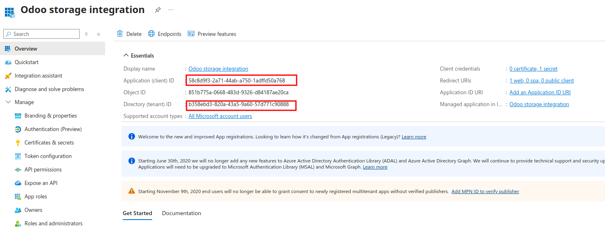
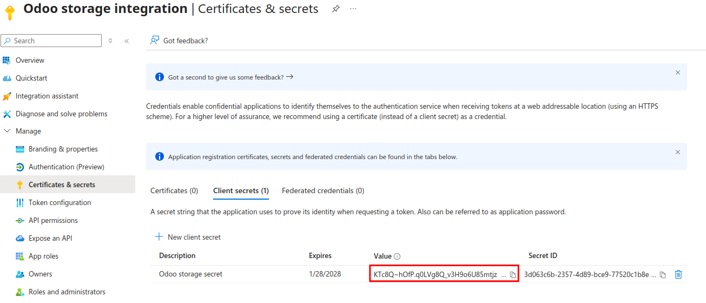
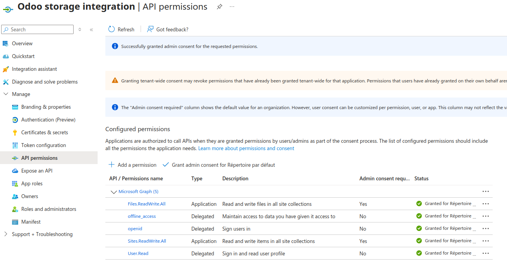
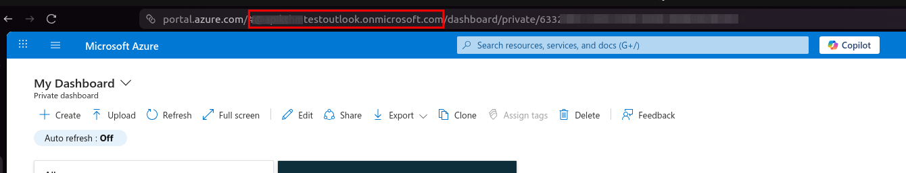
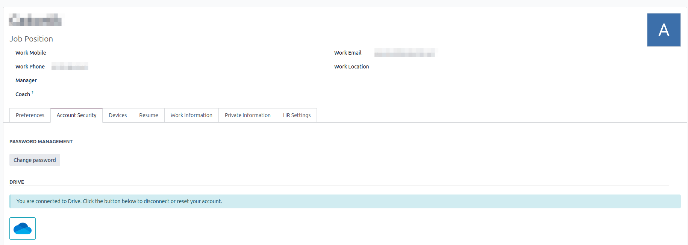

In order to use the Microsoft Drive Account module, you need to follow this process for link Odoo and Microsoft:

## PART 1 : Create an Azure Application

To allow Odoo to access Microsoft OneDrive or SharePoint through the Microsoft Graph API, you must create an application in Azure Active Directory.

Step 1 – Open the Azure portal and go to Azure Active Directory, then "App registrations", and click “New registration”.

Step 2 – Register the application. Set a name “Odoo storage integration”.
Select the third option "Accounts in any organizational directory (Any Microsoft Entra ID tenant - Multitenant) and personal Microsoft accounts (e.g. Skype, Xbox)"
Add a Redirect URI of type "Web". {URL of your Odoo instance}/microsoft_account/authentication.
Once the application is created, note the Application (client) ID and the Directory (tenant) ID.

Step 3 – Generate a client secret.
Go to Certificates & secrets, create a new client secret (Description : Odoo storage secret / Expires : 24month), and copy its value. 
You will not be able to see it again.

Step 4 – Configure API permissions.
Open API permissions, add Microsoft Graph "Application permissions", and include Files.ReadWrite.All, and Sites.ReadWrite.All. 
Add also "Delegated permission" for include  offline_access, openid.

IMPORTANT : Grant admin consent so the application can use these permissions.

 

## PART 2 : Set Odoo System Parameters

You need your tenant_url, you can find it in your Azure portal, open Home > Dashboard. Look at the URL, it's usually ends with onmicrosoft.com.

 

In Odoo, open Settings > Technical > System Parameters.

Required parameters:
* microsoft_account.auth_endpoint : This is the Microsoft OAuth2 authorization URL. It usually has the form: https://login.microsoftonline.com/{tenant_url}/oauth2/v2.0/authorize
* microsoft_account.token_endpoint : This is the token endpoint URL, usually: https://login.microsoftonline.com/{tenant_url}/oauth2/v2.0/token
* microsoft_drive_client_id : The Client ID of the Azure application.
* microsoft_drive_client_secret : The Client Secret value generated in Azure.

Optional parameter :
* microsoft_drive_client_scope : Defines the permissions requested by Odoo. If not defined, Odoo uses the default scopes: offline_access, openid, Files.ReadWrite.All, Sites.ReadWrite.All.

## PART 3 : Test the Configuration

Step 1 – In Odoo, go to your odoo profile and select "Account Security",then click on the “grey cloud icon".

Step 2 – You will be redirected to the Microsoft login page. Sign in and accept the requested permissions. You will then be redirected back to Odoo.

Step 3 – After authorization, Odoo should display a "blue cloud icon". The connection is now established.

 

